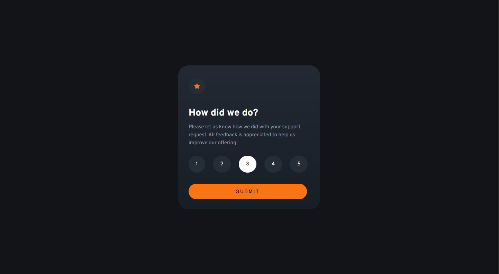
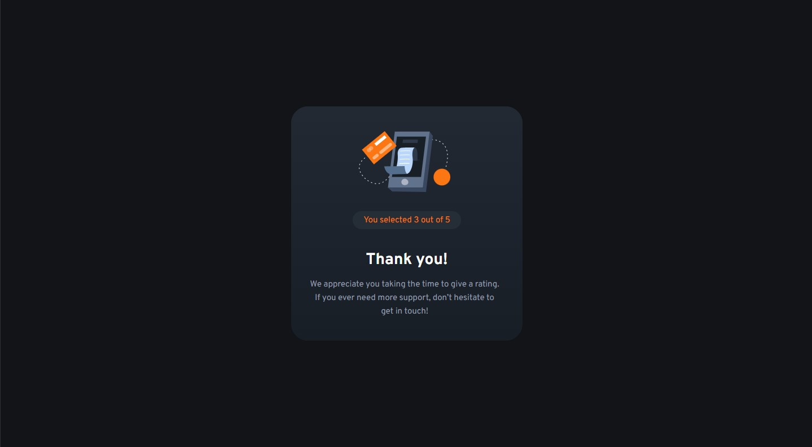
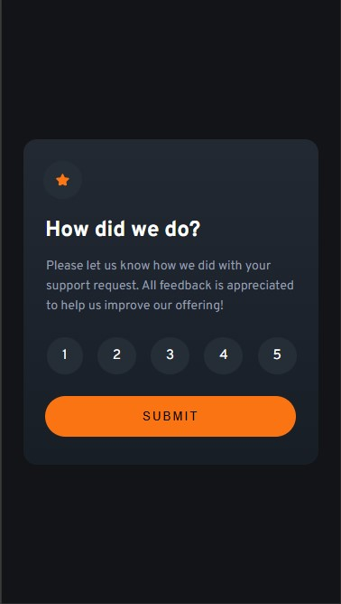
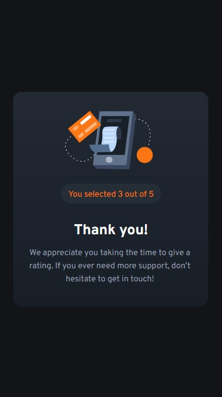

# Frontend Mentor - Interactive rating component solution

This is a solution to the [Interactive rating component challenge on Frontend Mentor](https://www.frontendmentor.io/challenges/interactive-rating-component-koxpeBUmI). Frontend Mentor challenges help you improve your coding skills by building realistic projects. 

## Table of contents

- [Overview](#overview)
  - [The challenge](#the-challenge)
  - [Screenshot](#screenshot)
  - [Links](#links)
- [My process](#my-process)
  - [Built with](#built-with)
  - [What I learned](#what-i-learned)
  - [Continued development](#continued-development) 
- [Author](#author)

## Overview

### The challenge

Users should be able to:

- View the optimal layout for the app depending on their device's screen size
- See hover states for all interactive elements on the page
- Select and submit a number rating
- See the "Thank you" card state after submitting a rating

### Screenshot

Desktop Version

Mobile Version

### Links

- Solution URL: [GitHub URL](https://github.com/AgnerShimokawa/interactive-rating-component)
- Live Site URL: [Live site URL](https://agnershimokawa.github.io/interactive-rating-component/)

## My process

### Built with

- Semantic HTML5 markup
- CSS custom properties
- Flexbox
- CSS Grid

### What I learned

With this challenge I've learned to get information from the DOM, getting a value from a specific value from a tag, and adding a text to a specific tag.

### Continued development

While doing this challenge I got stuck trying to figure it out how to get the value the user chose and display it on the console, only to realize that I was complicating things and it was much simpler to get to the solution. So for future project I'll try to not overthink and try to pre-solve the whole before trying to get to te specifics of it.

## Author

- GitHub - [AgnerShimokawa](https://github.com/AgnerShimokawa)
- Frontend Mentor - [@AgnerShimokawa](https://www.frontendmentor.io/profile/AgnerShimokawa)
- LinkedIn - [Agner Shimokawa](https://www.linkedin.com/in/agner-shimokawa/)